# Sordio

> Неофициальное приложение. Не связано с ПАО Сбербанк и SberDevices.
> SaluteJazz — товарный знак ПАО Сбербанк (рег. № 985267).

Управление микрофоном в веб-версии SaluteJazz глобальным хоткеем, с push-to-talk
и плашкой-индикатором поверх всех окон.

Хоткей нажимает **настоящую кнопку в интерфейсе SaluteJazz**, а не глушит
микрофон в системе, — поэтому собеседники видят правильный статус. Изменение
микрофона мышью в самом Джазе плашка тоже подхватывает.

| Действие | Результат |
|---|---|
| Короткое нажатие ⌃⌥A | Переключить микрофон |
| Удержание ⌃⌥A | Говорить, пока клавиша зажата (push-to-talk) |
| Клик по плашке | Переключить микрофон |
| Перетаскивание плашки | Переместить; позиция запоминается |

Плашка видна только во время звонка — вне его она ничего не показывает и
только занимала бы место на экране; состояние в это время видно по иконке в
строке меню. Если нажать хоткей, когда управлять нечем, плашка выйдет на
полторы секунды, подсветится оранжевым и подписью объяснит, почему ничего не
произошло: нет связи с браузером, нет звонка или кнопка микрофона не найдена.

Пункт меню «Плашка во время звонка» убирает её совсем.

Требования: macOS 14+ и браузер на Chromium — Google Chrome, Яндекс Браузер,
Vivaldi, Arc, Microsoft Edge, Opera, Brave.

## Установка

Пять минут, из них четыре — выдача разрешений macOS. Ставятся две вещи:
приложение ловит горячую клавишу, расширение нажимает кнопку микрофона на
странице. Работают они только вместе.

### 1. Поставить приложение

```bash
brew tap samplec0de/sordio https://github.com/samplec0de/sordio.git
brew trust samplec0de/sordio
brew install --cask sordio
```

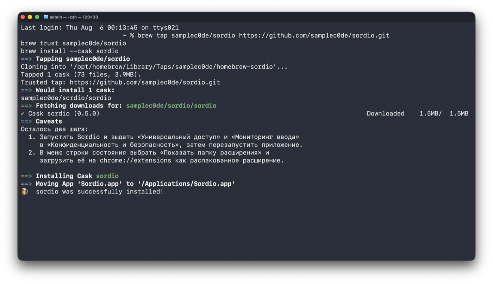

В конце Homebrew сам напомнит про два оставшихся шага — они ниже.

Адрес в `brew tap` указывается явно, потому что репозиторий называется
`sordio`, а не `homebrew-sordio`, — сам Homebrew его бы не нашёл.

Обновление — `brew upgrade --cask sordio`.

`brew trust` нужен потому, что Homebrew не выполняет формулы из посторонних
источников без явного разрешения. Здесь это существенно: при установке формула
снимает с приложения карантинную метку. Приложение подписано собственным
сертификатом, а не Developer ID, и без этого macOS отвечает «Apple could not
verify Sordio.app is free of malware» и открыть его не даёт.

Без Homebrew: скачать `Sordio-<версия>.dmg` со страницы
[Releases](https://github.com/samplec0de/sordio/releases), перетащить
приложение в «Программы» и снять карантин руками:

```bash
xattr -dr com.apple.quarantine /Applications/Sordio.app
```

### 2. Запустить

Sordio появится в Launchpad и в папке «Программы».

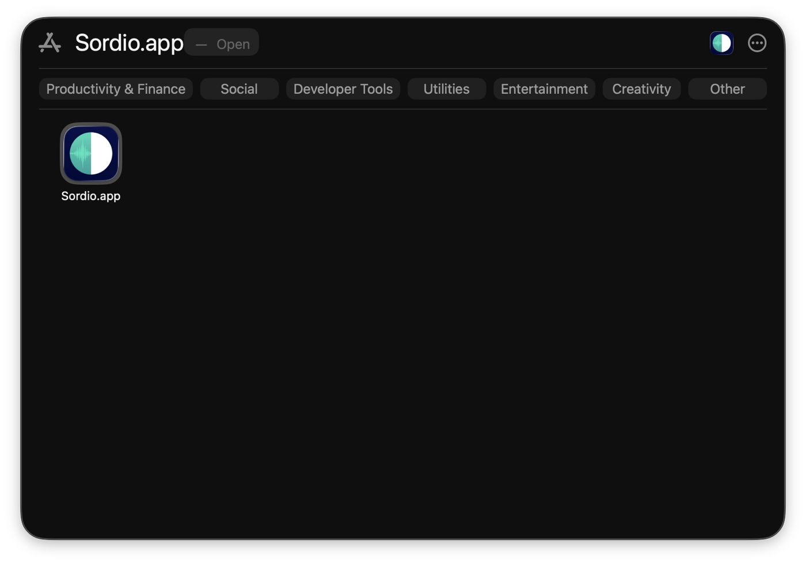

Окна у приложения нет — только иконка в строке меню. Так и должно быть.

### 3. Выдать два разрешения

При первом запуске Sordio скажет, чего ему не хватает, и откроет нужный раздел
настроек.

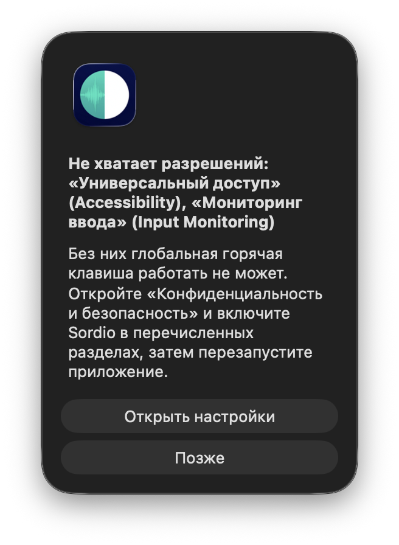

macOS может дополнительно показать свой запрос на управление компьютером:

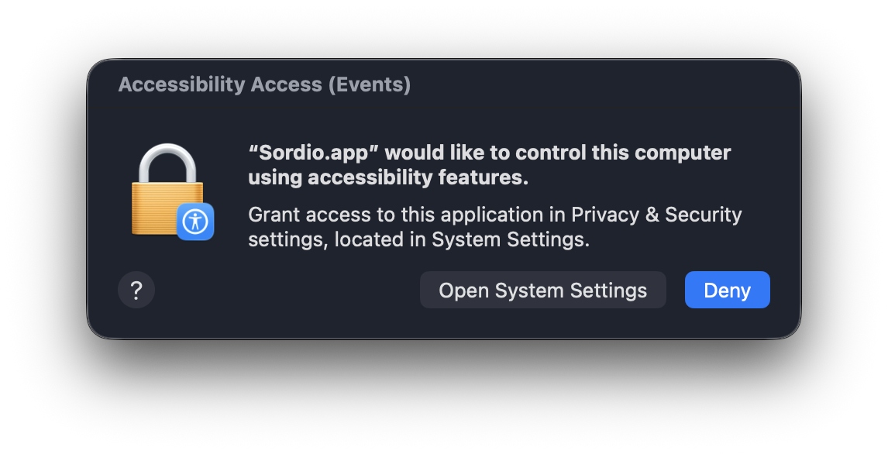

Нужны **оба** разрешения. Одного мало: с «Универсальным доступом», но без
«Мониторинга ввода» приложение выглядит рабочим, а горячая клавиша молчит.
Это самое частое место, где всё встаёт.

**Универсальный доступ.** «Системные настройки → Конфиденциальность и
безопасность → Универсальный доступ». Sordio уже в списке, переключатель
выключен:

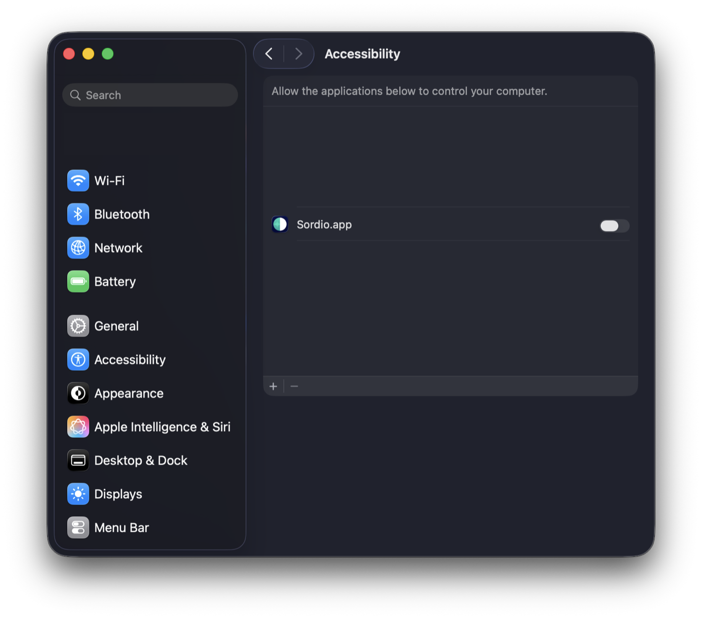

Включите его — macOS попросит Touch ID или пароль:

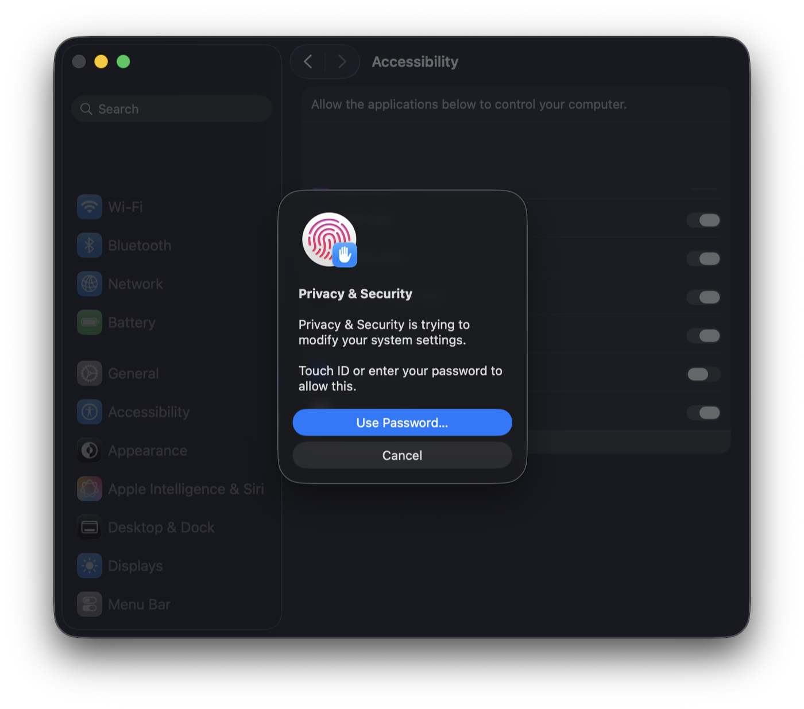

Готово:

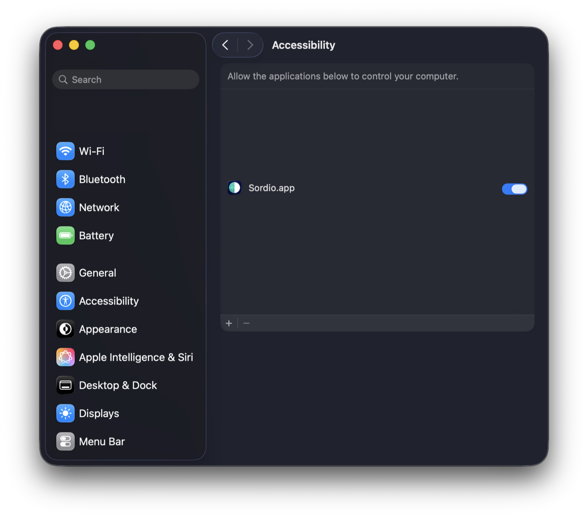

**Мониторинг ввода.** Соседний раздел. Сначала Sordio в списке нет — только
приложения, которым это разрешение уже выдано:

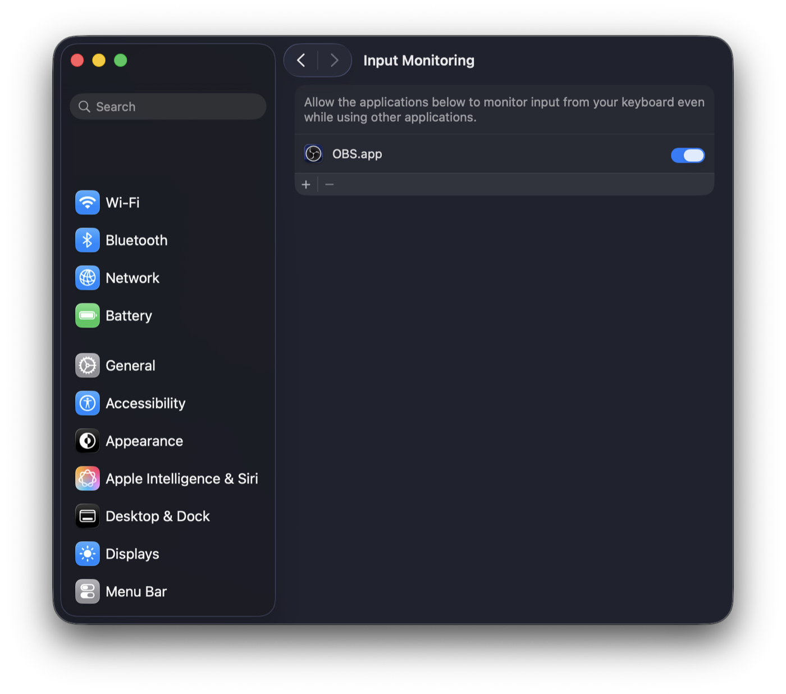

Добавьте Sordio кнопкой **+** и включите переключатель. macOS предупредит, что
разрешение начнёт действовать только после перезапуска приложения:

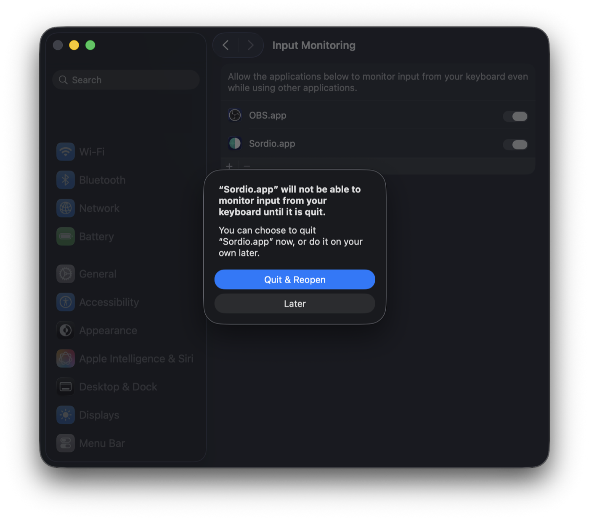

Нажмите **Quit & Reopen** — система перезапустит Sordio сама. Если выбрали
Later, перезапустите приложение вручную, иначе горячая клавиша работать не
будет.

Разрешение на микрофон не требуется: уровень звука для индикатора считает
расширение, а браузер и так держит микрофон ради звонка.

### 4. Загрузить расширение

Расширение лежит внутри приложения и в магазин расширений не выкладывается,
поэтому ставится вручную. Откройте `chrome://extensions` — этот адрес работает
во всех браузерах на Chromium: Google Chrome, Яндекс Браузер, Vivaldi, Arc,
Microsoft Edge, Opera, Brave. На снимках ниже — Vivaldi.

Включите **режим разработчика** — переключатель в правом верхнем углу:

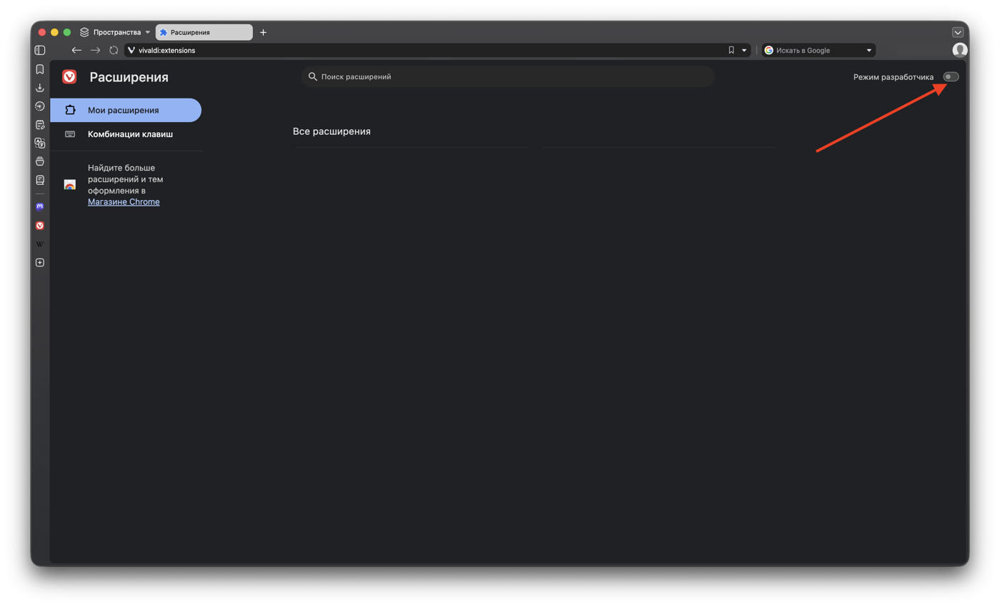

Появится кнопка **«Загрузить распакованным»**:

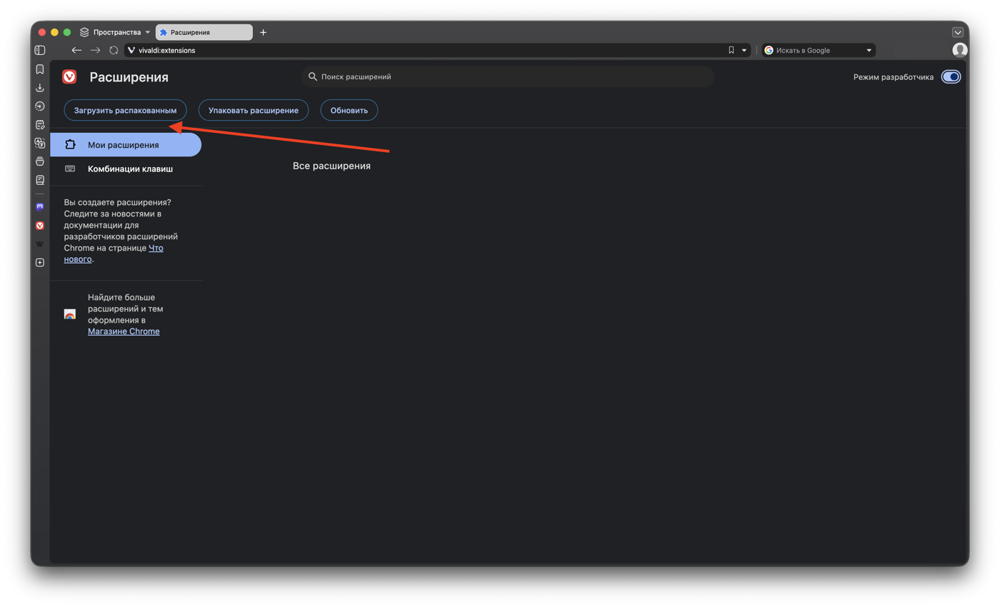

В открывшемся окне нажмите **⌘⇧G** и вставьте путь:

```
/Applications/Sordio.app/Contents/Resources/extension
```

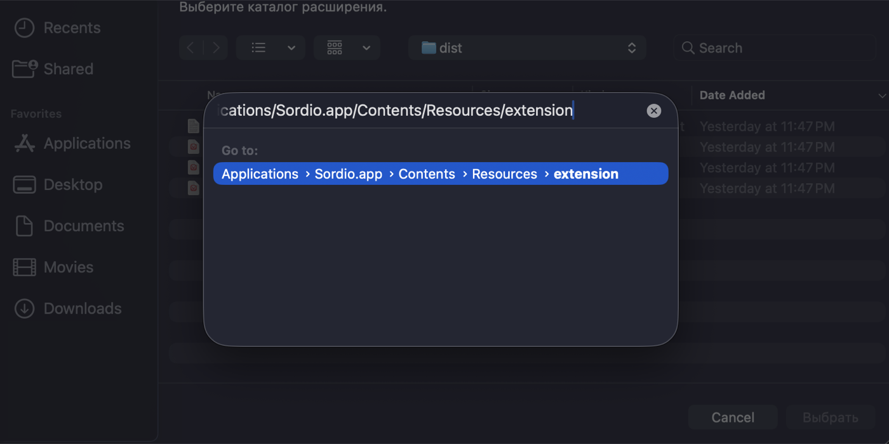

Проверьте, что внутри лежат `manifest.json`, `worker.js`, `content.js` и
`levelMain.js` — значит папка та. Нажмите **«Выбрать»**, саму папку открывать
не нужно.

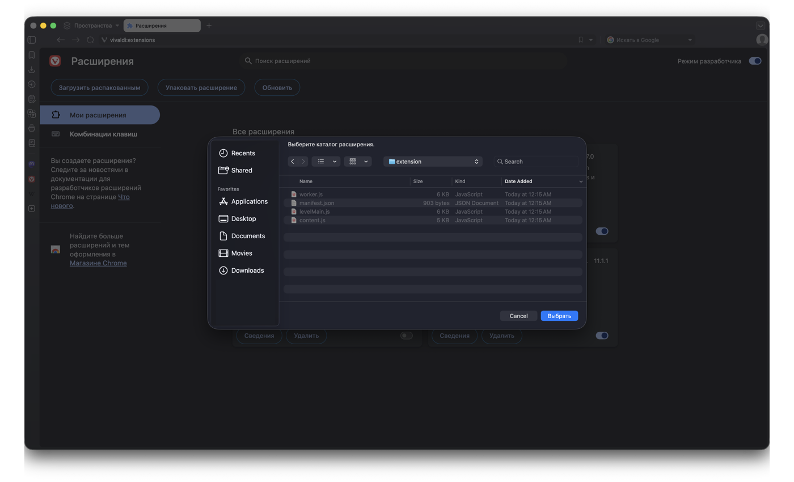

Тот же путь открывается из меню строки состояния — пункт **«Показать папку
расширения»**.

### 5. Разрешить подключение

Расширение соединяется с приложением по локальному сокету. При первом
подключении Sordio спросит разрешение и покажет идентификатор клиента:

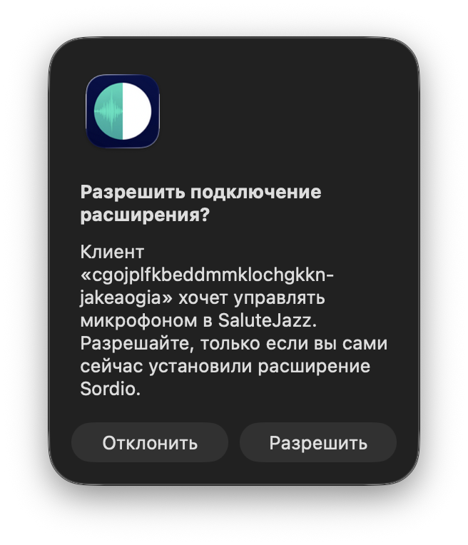

Нажмите **«Разрешить»**, если вы действительно только что установили
расширение. Приложение слушает только `127.0.0.1`, наружу ничего не уходит, но
подтверждение спрашивается специально: так посторонняя страница не сможет молча
получить управление вашим микрофоном.

После разрешения запоминаются идентификатор расширения и выданный
ему секрет; молча пускается только клиент, у которого совпало и то, и другое.

Если к порту подключится кто-то ещё, мост при этом не рвётся: спаренное
расширение остаётся подключённым, пока претендент не спарится сам. Клиент с
другим идентификатором получит отдельный диалог, прямо предупреждающий, что
подключается не то расширение, которое было спарено. После отказа новые диалоги
минуту не показываются — чтобы страницу нельзя было заставить заваливать экран
модальными окнами.

После обновления приложения расширение надо обновить тоже: на
`chrome://extensions` нажать «Обновить» у Sordio и перезагрузить вкладку
SaluteJazz.

### 6. Проверить

Зайдите в звонок на `salutejazz.ru`. Плашка появляется только во время звонка.

Микрофон включён — зелёный значок и живая шкала уровня:

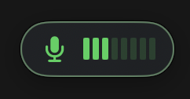

Микрофон выключен — красный перечёркнутый значок, шкала погашена:

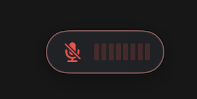

Проверьте всё вместе: короткое нажатие **⌃⌥A** переключает микрофон, удержание
включает его на время удержания, клик по плашке тоже переключает, а кнопка
микрофона в самом SaluteJazz и плашка показывают одно и то же.

### Если не работает

**Перезапустите приложение и браузер.** Это лечит большинство случаев:
разрешения macOS вступают в силу только после перезапуска приложения, а
расширение подключается к приложению при загрузке страницы.

```bash
osascript -e 'quit app "Sordio"'; sleep 1; open -a Sordio
```

Затем закройте браузер целиком (**⌘Q**, не просто окно) и откройте заново.
Страницу SaluteJazz после этого тоже перезагрузите.

Если не помогло, нажмите **⌃⌥A** вне звонка: плашка выйдет на полторы секунды,
подсветится оранжевым и подпишет причину.

| Что показывает плашка | Что делать |
|---|---|
| Нет связи с браузером | Расширение не загружено или выключено — проверьте `chrome://extensions` |
| Нет звонка | Откройте вкладку со звонком в SaluteJazz |
| Кнопка микрофона не найдена | Перезагрузите страницу звонка |

Если плашка не реагирует на клавишу вовсе — дело в разрешениях. Проверьте, что
Sordio включён **в обоих** разделах, «Универсальный доступ» и «Мониторинг
ввода», и что после включения приложение было перезапущено.

## Как это устроено

Приложение слушает `127.0.0.1` и занимает первый свободный порт из диапазона
`8765–8775`; расширение перебирает те же порты. Никаких внешних соединений нет.

Уровень микрофона считает скрипт расширения в главном мире страницы. Он
клонирует ту дорожку, которую сайт отдаёт в звонок: SaluteJazz глушит микрофон
через `track.enabled = false`, и по самой дорожке уровень был бы нулевым ровно
в том случае, ради которого индикатор и задуман, — когда человек говорит в
выключенный микрофон. У клона собственный флаг при общем источнике, поэтому
предупреждение «вас не слышно» работает. Вне звонка клон закрывается.

## Разработка

```bash
# нужно для `swift test`: XCTest живёт в SDK Xcode, а активен обычно CommandLineTools
export DEVELOPER_DIR=/Applications/Xcode.app/Contents/Developer

(cd app && swift test)                 # тесты приложения
(cd extension && npm ci && npm test)   # тесты расширения

(cd app && ./Scripts/build-app.sh)     # отладочная сборка .app
```

Отладочная сборка кладёт в бандл то расширение, что лежит в `extension/dist`, —
собрать его надо самому (`npm run build`).

Про подпись см. `app/Scripts/SIGNING.md`. Все сборки подписываются одним
самоподписанным сертификатом `Sordio Dev`: macOS привязывает выданные
разрешения к подписи, и смена сертификата сбросит их у всех, кому приложение
уже поставлено.

### Выпуск версии

```bash
./Scripts/release.sh 0.3.0
```

Скрипт сам поднимает версию в `Info.plist` и в манифесте расширения, собирает
универсальный бинарник, упаковывает DMG, публикует релиз на GitHub и
обновляет формулу в `Casks/sordio.rb`. Выпуск идёт только с `main`:
формулу `brew tap` читает с ветки по умолчанию. Сертификат `Sordio Dev`
обязан быть в связке ключей — иначе у всех слетят разрешения.

## Ручная проверка

`docs/manual-verification.md` — чек-лист того, что автотесты проверить не могут:
реальный звонок, хоткей из другого приложения, двусторонняя синхронизация.

## Лицензия

MIT — см. [LICENSE](LICENSE).

Неофициальное приложение. Не связано с ПАО Сбербанк и SberDevices.
SaluteJazz — товарный знак ПАО Сбербанк.
