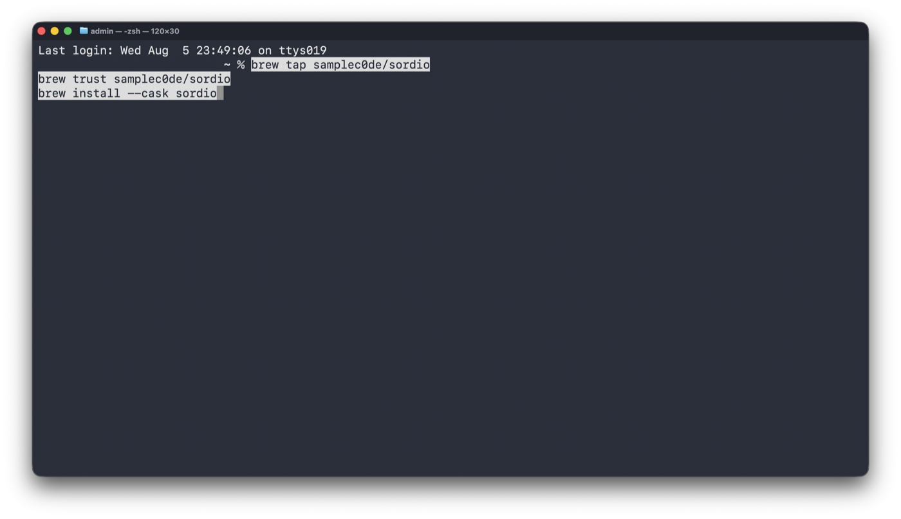

# Установка Sordio

Пошагово, со снимками экрана. Занимает пять минут, из них четыре — выдача
разрешений macOS.

Приложение и расширение ставятся отдельно и работают только вместе:
приложение ловит горячую клавишу, расширение нажимает кнопку микрофона на
странице SaluteJazz.

---

## 1. Установить приложение

```bash
brew tap samplec0de/sordio https://github.com/samplec0de/sordio.git
brew trust samplec0de/sordio
brew install --cask sordio
```


В конце Homebrew сам напомнит про два оставшихся шага — разрешения и
расширение. Они ниже.

> **Адрес в первой команде обязателен.** Без него Homebrew ищет репозиторий
> `homebrew-sordio`, которого не существует, и падает с `Repository not found`.
>
> 

`brew trust` нужен потому, что формула снимает с приложения карантинную метку.
Приложение подписано собственным сертификатом, а не Developer ID, и без этого
macOS откажется его открывать.

---

## 2. Запустить

Sordio появится в Launchpad и в папке «Программы».


Окна у приложения нет — только иконка в строке меню. Так и должно быть.

---

## 3. Выдать два разрешения

При первом запуске Sordio скажет, чего ему не хватает, и предложит открыть
нужный раздел настроек.


macOS может дополнительно показать свой запрос на управление компьютером:


Нужны **оба** разрешения. Одного мало: с «Универсальным доступом», но без
«Мониторинга ввода» приложение выглядит рабочим, а горячая клавиша молчит.
Это самое частое место, где всё встаёт.

### Универсальный доступ

«Системные настройки → Конфиденциальность и безопасность → Универсальный
доступ». Sordio уже в списке, переключатель выключен:


Включите его — macOS попросит Touch ID или пароль:


Готово:


### Мониторинг ввода

Соседний раздел, «Мониторинг ввода». Сначала Sordio в списке нет — только
другие приложения, которым это разрешение уже выдано:


Добавьте Sordio кнопкой **+** и включите переключатель. macOS предупредит, что
разрешение начнёт действовать только после перезапуска приложения:


Нажмите **Quit & Reopen** — система перезапустит Sordio сама. Если выбрали
Later, перезапустите приложение вручную, иначе горячая клавиша работать не
будет.

---

## 4. Загрузить расширение

Расширение лежит внутри приложения и в магазин расширений не выкладывается,
поэтому ставится вручную. Откройте `chrome://extensions` — адрес работает во
всех браузерах на Chromium, включая Vivaldi. На снимках ниже как раз Vivaldi.

Включите **режим разработчика** — переключатель в правом верхнем углу:


Появится кнопка **«Загрузить распакованным»**:


В открывшемся окне нажмите **⌘⇧G** и вставьте путь:

```
/Applications/Sordio.app/Contents/Resources/extension
```


Проверьте, что внутри лежат `manifest.json`, `worker.js`, `content.js` и
`levelMain.js` — значит папка та. Нажмите **«Выбрать»**, саму папку открывать
не нужно.


Тот же путь можно открыть из меню строки состояния — пункт **«Показать папку
расширения»**.

---

## 5. Разрешить подключение

Расширение соединяется с приложением по локальному сокету. При первом
подключении Sordio спросит разрешение и покажет идентификатор клиента:


Нажмите **«Разрешить»**, если вы действительно только что установили
расширение. Приложение слушает только `127.0.0.1`, наружу ничего не уходит, но
подтверждение спрашивается специально: так посторонняя страница не сможет
молча получить управление вашим микрофоном.

---

## 6. Проверить

Зайдите в звонок на `salutejazz.ru`. Плашка появляется только во время звонка.

Микрофон включён — зелёный значок и живая шкала уровня:


Микрофон выключен — красный перечёркнутый значок, шкала погашена:


Проверьте всё вместе:

- короткое нажатие **⌃⌥A** переключает микрофон;
- удержание **⌃⌥A** включает микрофон, пока клавиша зажата;
- клик по плашке переключает микрофон;
- кнопка микрофона в самом SaluteJazz и плашка показывают одно и то же.

---

## Если не работает

**Перезапустите приложение и браузер.** Это лечит большинство случаев:
разрешения macOS вступают в силу только после перезапуска приложения, а
расширение подключается к приложению при загрузке страницы.

```bash
osascript -e 'quit app "Sordio"'; sleep 1; open -a Sordio
```

Затем полностью закройте браузер (**⌘Q**, не просто окно) и откройте заново.
Страницу SaluteJazz после этого тоже перезагрузите.

Если не помогло, нажмите **⌃⌥A** вне звонка: плашка выйдет на полторы секунды,
подсветится оранжевым и подпишет причину.

| Что показывает плашка | Что делать |
|---|---|
| Нет связи с браузером | Расширение не загружено или выключено — проверьте `chrome://extensions` |
| Нет звонка | Откройте вкладку со звонком в SaluteJazz |
| Кнопка микрофона не найдена | Перезагрузите страницу звонка |

Если плашка вообще не реагирует на клавишу — дело в разрешениях. Проверьте,
что Sordio включён **в обоих** разделах: «Универсальный доступ» и «Мониторинг
ввода», и что после включения приложение было перезапущено.
